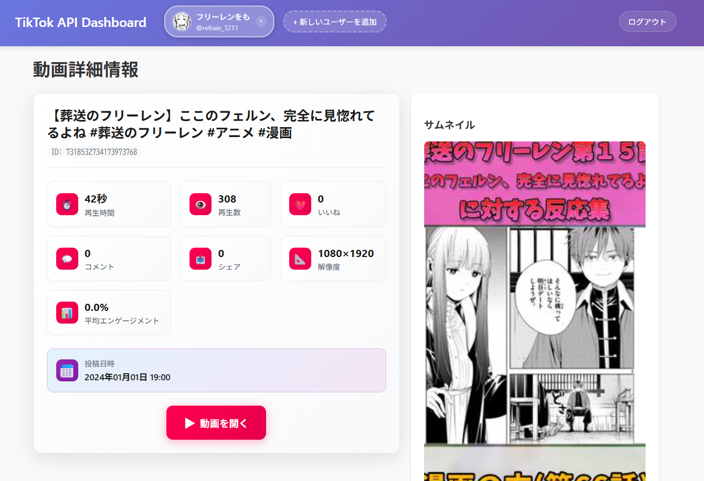

# TikTok API Features

[English](./docs/lang/en.md) | 日本語

TikTok API を使用してユーザープロフィール情報と投稿動画を取得・表示するアプリです。

## UI 紹介(2025.08.05)

### ログイン画面(/)


### ダッシュボード(/dashboard)

<div style="display: flex; column-gap:8px;">
    
    
</div>

### 動画詳細画面(/video/id)

<div style="display: flex; column-gap:8px;">
    
</div>

### アップロード(/upload)

<div style="display: flex; gap:8px; flex-wrap: wrap;">
    
    
    
</div>

## 提供機能

### 認証・ユーザー管理

- **TikTok OAuth 2.0 認証（PKCE 方式）**
- **マルチユーザー対応**: 複数アカウントの同時管理
- **ユーザー切り替え機能**: ヘッダーから簡単にアカウント切り替え
- **セッション管理**: アクセストークンの自動更新と期限管理

### プロフィール・統計情報

- **ユーザープロフィール情報の取得・表示**
  - アバター画像、表示名、ユーザー名
  - 自己紹介文、認証済みアカウント表示
  - プロフィールページへの直接リンク
- **詳細統計情報の表示**
  - フォロー数・フォロワー数・いいね数・動画数
  - 総再生数・総シェア数・平均エンゲージメント率

### 動画管理・分析

- **投稿動画一覧の取得・表示**
  - サムネイル画像付きカード表示
  - 6 件ごとのページネーション機能
  - 動画 ID、投稿日時、統計情報の表示
- **動画詳細情報の表示**
  - 再生時間、解像度、エンゲージメント率
  - 再生数・いいね数・コメント数・シェア数
  - TikTok 埋め込みリンクでの動画視聴

### 動画投稿機能

- **TikTok Content Posting API 対応**
  - **直接投稿**: 即座に TikTok に投稿
  - **下書き投稿**: TikTok アプリで後から投稿可能
- **投稿設定オプション**
  - キャプション（最大 2200 文字、ハッシュタグ対応）
  - プライバシー設定（未監査アプリは「自分だけ」のみ）
  - コメント・デュエット・ステッチの無効化設定
- **ファイル管理**
  - 動画ファイルサイズ制限（最大 100MB）
  - 対応形式: MP4、AVI、MOV、WMV
  - ファイル情報の事前表示
- **投稿制限対応**
  - 5 分間の投稿間隔制限
  - スパム対策エラーの自動検出
  - プライベートアカウント要件の確認

## 導入手順

### Sandbox の設定

参考サイト: [TikTok for Developers アカウント作成方法](https://nfr-log.com/how-to_create_tiktokfordevelopers/#index_id2)

アカウントを追加しポータル設定画面にアクセス出来たら、Sandbox 環境で以下のように設定してください

<div style="display: flex; gap:8px; flex-wrap: wrap;">
    
    
    
    
    
    
    
    
    
</div>

### リポジトリのセットアップ

#### 1. リポジトリのクローン

```bash
git clone <repository>
cd tiktok-api-features
```

#### 2. 仮想環境の作成とアクティベート

```bash
# Linux(必要に応じて)
sudo apt update && sudo apt install -y python3.12-venv

# Python仮想環境を作成
python3 -m venv venv

# 仮想環境をアクティベート
source venv/bin/activate
```

#### 3. 依存関係のインストール

```bash
pip install -r requirements.txt
```

#### 4. 環境変数の設定

```bash
# .envファイルを作成
cp env.example .env
```

#### 5. アプリケーションの実行

```bash
python main.py
```

#### 6. ブラウザでアクセス

```
http://localhost:3456
```

#### 注意事項

- Python 3.8 以上が必要です
- TikTok for Developers アカウントとアプリの設定が必要です
- 環境変数の設定は必須です（詳細は「Sandbox の設定」を参照）
